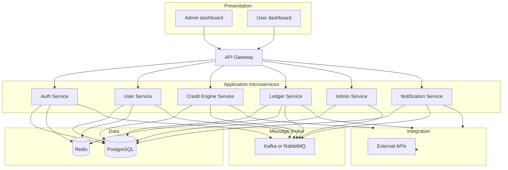

# FinEra — System Architecture (Step 1)

This document defines the **target** layered architecture, **microservice** boundaries, **API gateway** design, **event-driven** contracts, **multi-currency** isolation, and **admin audit** requirements. It maps to the current monorepo layout (`src/` frontend, `backend-core/` application tier) and describes how to evolve toward separate deployables.

---

## 1. Architectural layers

| Layer | Responsibility | FinEra placement |
|--------|----------------|------------------|
| **Presentation** | Admin and user dashboards; routing; forms; display-only state; **no** balance/credit math | `src/` (Vite + React) |
| **Application** | Microservices: auth, users, credit, ledger, admin, notifications; orchestration; validation; domain rules | `backend-core/src/services/*`, `backend-core/src/api-gateway/` |
| **Data** | ACID money flows, ledgers, profiles, audit append-only logs; caching and idempotency | PostgreSQL + Prisma (`prisma/`, `infrastructure/database/`); Redis (sessions, rate limits, dedup keys, read models) |
| **Integration** | External PSPs, KYC vendors, SMS/email providers, FX rate feeds; adapters only — **no** core ledger rules here | `backend-core/src/integration/` (adapters, webhooks, retry policies) |

**Rule:** All financial logic (balances, limits, interest, postings, eligibility) lives in **Application** + **Data** services. The UI calls APIs and renders returned numbers.

---

## 2. Service architecture

Six backend services (logical boundaries; may ship as one Node process until containers are split).



### 2.1 Service responsibilities

| Service | Owns | Must NOT own |
|---------|------|----------------|
| **Auth** | Registration, login, refresh, OTP, password flows, JWT issuance, session invalidation | Wallet balances, credit decisions |
| **User** | Profile, KYC metadata, references; user-scoped reads coordinated with Ledger for “display wallets” via API | Posting to ledger |
| **Credit Engine** | Scoring, limits, loan lifecycle **business rules**, interest **parameters** as data — execution of money movement still goes through Ledger | Double-entry journal lines (delegates to Ledger) |
| **Ledger** | **Double-entry** chart of accounts, journals, balances per currency wallet, repayments, deposits, withdrawals, idempotent commands | User profile fields |
| **Admin** | Config, learning content, partner program, **audit log append** for every admin mutation | End-user notification delivery (delegate to Notification) |
| **Notification** | Email/SMS/push **orchestration**, templates, delivery status, in-app inbox | Ledger postings |

### 2.2 Double-entry (Ledger Service)

- Every monetary movement is a **balanced journal** (sum of debits = sum of credits) in **one currency per journal** (no mixed-currency single journal).
- User-visible “balance” is always derived from Ledger (or materialized view fed by Ledger), never from the client.

### 2.3 Inter-service communication

- **Synchronous:** Gateway → service HTTP (internal base URLs when split); only for request/response that must complete in one call (e.g. authenticated read).
- **Asynchronous:** All **major** domain actions publish **events** to the broker (see §4). Downstream services subscribe (e.g. Notification on `LoanApproved`, Audit on `AdminConfigChanged`).

---

## 3. API gateway design

The gateway is the **single public HTTP entry** for browsers and partner callbacks (webhooks may also hit Integration adapters behind the same or a dedicated ingress).

### 3.1 Concerns

| Concern | Behavior |
|---------|----------|
| **TLS termination** | At load balancer / reverse proxy in production |
| **Authentication** | JWT validation on protected routes; optional API keys for B2B webhooks on Integration routes |
| **Authorization** | Role claims (`user` vs `admin`); route-level guards; never trust client-side role |
| **Routing** | Path-prefix to service handlers (`/api/v1/auth` → Auth, `/api/v1/wallet` → Ledger, etc.) |
| **Rate limiting** | Stricter on `/auth`; general bucket elsewhere; Redis-backed when horizontal scaling |
| **Request ID** | Propagate `X-Request-Id` to logs and downstream calls |
| **CORS** | Allowlist frontend origins only |
| **Idempotency** | For POSTs that move money: `Idempotency-Key` header stored in Redis/DB (Ledger owns enforcement) |

### 3.2 Public route map (illustrative)

| Prefix | Service | Notes |
|--------|---------|------|
| `/api/v1/auth/*` | Auth | Public + refresh |
| `/api/v1/user/*` | User | Authenticated |
| `/api/v1/kyc/*`, `/api/v1/reference/*` | User | Authenticated / mixed |
| `/api/v1/wallet/*`, `/api/v1/transactions/*` | Ledger | Authenticated |
| `/api/v1/credit/*` | Credit Engine | Authenticated |
| `/api/v1/notifications/*` | Notification | Authenticated |
| `/api/v1/learning/*`, `/api/v1/partner-program/*` | Admin | Often admin-guarded |
| `/api/v1/admin/audit/*` | Admin | Admin-only read |
| `/health`, `/ready` | Gateway | Liveness / DB readiness |

Current implementation mounts many of these in `backend-core/src/api-gateway/app.ts`; **Notification** routes may still live under `admin-service` until extracted to `notification-service`.

### 3.3 Gateway evolution

- **Phase A (now):** One Express `app` composes route modules.
- **Phase B:** Standalone gateway process (Kong, Envoy, or Node) proxies to service URLs.
- **Phase B+:** gRPC or connect-RPC internally; REST only at the edge.

---

## 4. Event-driven architecture

**Broker:** **Apache Kafka** (preferred at scale, replay, partitions) or **RabbitMQ** (simpler ops, classic queues). Choose one per environment; abstract with a thin publisher/subscriber in `infrastructure/messaging/`.

### 4.1 Principles

- **Emit after commit:** Publish only after the owning service’s DB transaction commits (outbox pattern in PostgreSQL recommended).
- **Schema:** Event name + version + `occurredAt` + `correlationId` + payload IDs (no PII in topic names).
- **Consumers:** Idempotent (`eventId` or dedup in Redis).

### 4.2 Major events (illustrative catalog)

| Domain event | Producer | Typical subscribers |
|--------------|----------|---------------------|
| `UserRegistered` | Auth | Notification, Audit |
| `EmailVerified` | Auth | User, Notification |
| `KycSubmitted` | User | Admin, Notification |
| `CreditApplicationSubmitted` | Credit Engine | Notification, Audit |
| `LoanApproved` / `LoanRejected` | Credit Engine | Ledger (if approval triggers disbursement command), Notification |
| `JournalPosted` | Ledger | Credit Engine (projections), Notification |
| `RepaymentReceived` | Ledger | Credit Engine, Notification |
| `AdminConfigUpdated` | Admin | Audit (required), Notification |
| `FundsDeposited` / `FundsWithdrawn` | Ledger | Notification, Fraud (async) |

Every **admin mutation** must emit an event and **append an audit row** (see §6).

---

## 5. Multi-currency enforcement (USD, ZiG, ZAR)

| Rule | Implementation hint |
|------|----------------------|
| **Isolation** | Separate ledger **accounts** / **wallet rows** per `(userId, currency)` — never one balance field mixing currencies |
| **Posting** | Journal lines tagged with a single `currency` code; validation rejects mixed-currency journals |
| **FX** | Conversions are explicit transactions (e.g. sell ZAR / buy USD) via Ledger + `fx.service` rates from Integration; no silent cross-currency in one “transfer” without FX leg |
| **API** | Client sends `currency` where relevant; server validates against allowed set `{ USD, ZIG, ZAR }` |

Existing code paths: `ledger-service/currency.config.ts`, `currency-context.ts`, `currencies.routes.ts`.

---

## 6. Admin audit logs

| Requirement | Behavior |
|-------------|----------|
| **Coverage** | Every admin action that **creates, updates, or deletes** protected resources |
| **Storage** | Append-only table(s): `actorAdminId`, `action`, `resourceType`, `resourceId`, `before`/`after` JSON (or hash), `ip`, `userAgent`, `requestId`, `timestamp` |
| **Access** | Read API for auditors; no in-place edits |
| **Dual write** | Same transaction as the mutation **or** transactional outbox + worker; must not lose audit if domain write succeeds |

---

## 7. Target repository folder structure

```
FinEra Inclusive Credit/
├── docs/
│   └── FinEra-Architecture-Step1.md    # This document
├── src/                                 # Presentation — User + Admin UIs
│   ├── app/
│   ├── services/                        # HTTP clients only (no money math)
│   └── ...
├── backend-core/
│   ├── prisma/
│   ├── src/
│   │   ├── api-gateway/                 # HTTP composition, middleware, health
│   │   │   ├── app.ts
│   │   │   └── server.ts
│   │   ├── services/
│   │   │   ├── auth-service/
│   │   │   ├── user-service/
│   │   │   ├── credit-engine/
│   │   │   ├── ledger-service/          # Double-entry, wallets, transactions
│   │   │   ├── admin-service/           # Config, learning, partner; audit writers
│   │   │   └── notification-service/  # Target home for notification delivery (extract from admin when splitting)
│   │   ├── integration/                 # External PSP, KYC, SMS, FX feeds — adapters
│   │   ├── infrastructure/
│   │   │   ├── database/
│   │   │   ├── ledger/                  # Double-entry primitives shared in-process
│   │   │   └── messaging/               # Kafka/RabbitMQ publishers, consumers, outbox
│   │   ├── middlewares/
│   │   ├── config/
│   │   ├── shared/
│   │   └── types/
│   └── package.json
└── docker-compose.yml                   # postgres, redis; later: broker, services
```

---

## 8. Mapping: current repo → target

| Target | Current notes |
|--------|----------------|
| Six services | Implemented as folders under `backend-core/src/services/*`; single process |
| Notification Service | `notification.routes.ts` still under `admin-service/` — migrate to `notification-service/` when splitting |
| Integration layer | New `integration/` root for outbound adapters |
| Message broker | `infrastructure/messaging/` scaffolded; wire publisher in a later step |
| API Gateway | `api-gateway/app.ts` is the gateway |

---

## 9. Next implementation steps (for later phases)

1. Add **outbox** tables and a dispatcher worker for reliable events.
2. Extract **Notification Service** routes and workers to `notification-service/`.
3. Centralize **admin audit** writes in Admin Service with a shared middleware helper.
4. Add **Redis** usage for idempotency + rate limit shards in multi-instance deployment.
5. Split **Dockerfile** per service and compose stack with broker + gateway.

---

*Document version: Step 1 — folder structure, service architecture, and API gateway design.*
