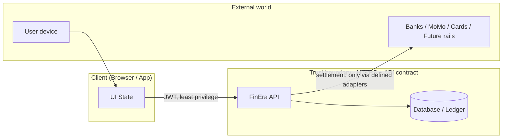

# FinEra - One Page (Actors, Flows, Trust Boundaries)

**Purpose:** Align investors and engineers on *what FinEra is*, *who touches what*, and *where trust and risk live*. Use this to decide **what to build next** (product vs. infrastructure vs. compliance).

---

## One-liner

**FinEra** is an inclusive financial ecosystem for students, staff, and alumni: **multi-currency savings (FinCash wallets)**, **credit with discipline rules**, and **repayment / ledger-style money movement**-with the **API + database** as the system of record, not the mobile UI.

---

## Actors

| Actor | Role | Primary concern |
|--------|------|------------------|
| **End user (member)** | Registers, verifies identity channel (email), holds wallets per currency, borrows and repays | Fair terms, clarity of balances, uptime, dispute resolution |
| **FinEra platform (app + API)** | Auth, profiles, wallets, credit decisions (rules/engine), transactions, statements | Correct balances, audit trail, abuse prevention |
| **Custody / rails (future or integrated)** | Banks, mobile money, card networks, blockchain where applicable | Settlement, liquidity, regulatory coverage per rail |
| **Institution (university / employer)** | Optional: eligibility, affiliation, future payroll or bursary flows | Data sharing agreements, accuracy of affiliation |
| **Operator / risk** | Monitoring, limits, manual review, collections policy | Fraud, AML posture (as product matures), operational playbooks |
| **Investor / regulator (external)** | Expectations on governance, capital, and licensing path | Transparency on scope: *what is built vs. what is planned* |

---

## Core flows (happy path, conceptual)

1. **Onboard:** register → verify email → profile / KYC depth as product requires → active account.  
2. **Fund:** deposit / transfer in **per-currency FinCash wallet** (USD, ZiG, ZAR, … as supported).  
3. **Borrow:** eligibility + savings/discipline rules → application → approval → **disbursement** to the right **currency-scoped** wallet / credit bucket.  
4. **Repay:** scheduled / manual repayment from allowed sources (e.g. wallet), **ledger-backed** updates.  
5. **Observe:** balances, transactions, and credit state **read from backend**, not guessed in the client.

*Non-goals in v1 (unless explicitly scoped):* cross-currency netting without FX policy; anonymous usage; unaudited “infinite leverage.”

---

## Trust boundaries (where responsibility splits)

| Boundary | Inside FinEra’s control | Outside / shared |
|----------|-------------------------|------------------|
| **UI ↔ API** | Auth tokens, validation, rate limits, idempotent money APIs | User device compromise (malware, phishing) |
| **API ↔ DB** | Transactions, balances, loan state, audit fields | Raw DB credentials must never live in the client |
| **API ↔ payment rails** | Orchestration, reconciliation design | Partner SLAs, regulatory licensing per country/rail |
| **“Truth”** | **Server-side balances and ledger** are authoritative | Client cache is **display only** |

**Engineering implication:** anything that can move money or change credit state must be **idempotent**, **logged**, and **authorized** on the server-not reconstructed from local storage alone.

---

## What to build next (signals)

**Product:** clearer repayment UX, dispute / support hooks, transparency copy on fees and FX (when added).  
**Infrastructure:** abuse controls (rate limits, device signals), backup/restore runbooks, secrets rotation.  
**Assurance:** threat model light review, then pen-test on auth + wallet + credit paths before handling real funds at scale.  
**Compliance:** map *jurisdiction* (e.g. ZW/ZA/US touchpoints) to licensing and KYC depth-early, even if MVP is narrow.

---

*This is a living sketch: update when custody partners, currencies, or regulatory scope change.*
